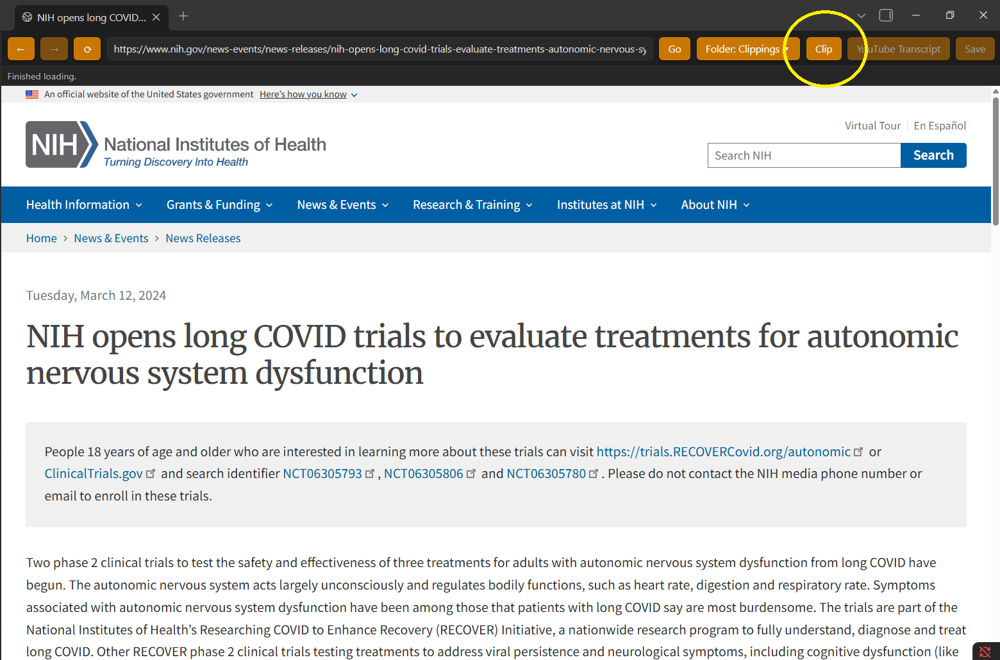
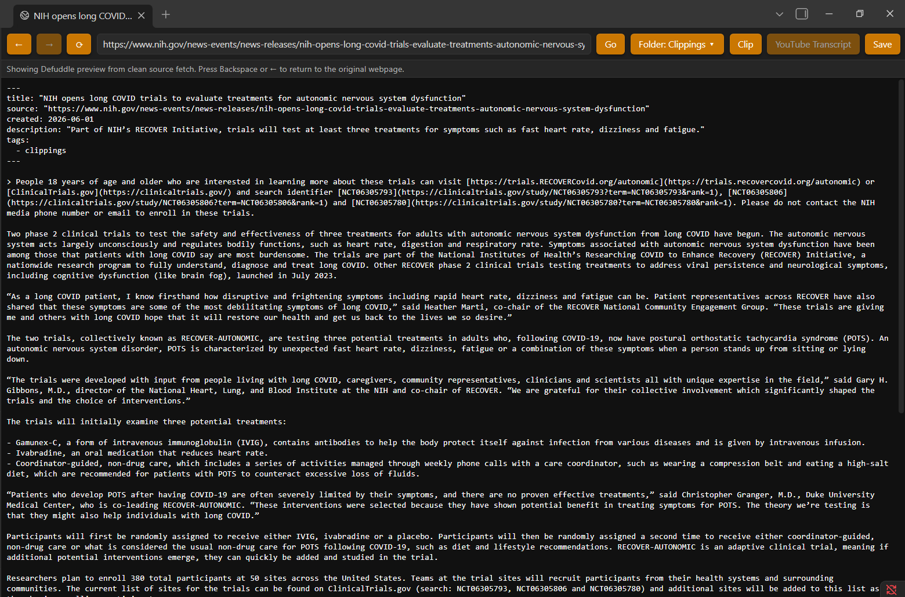
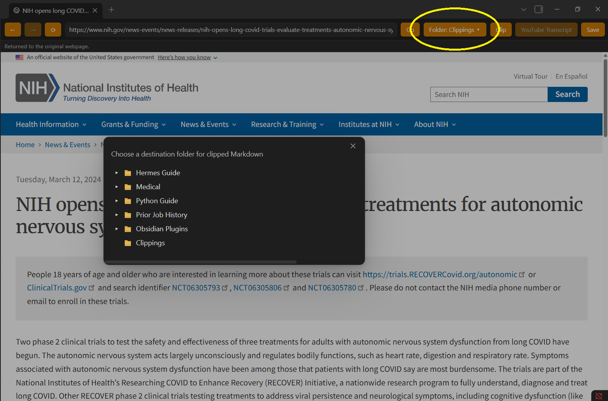
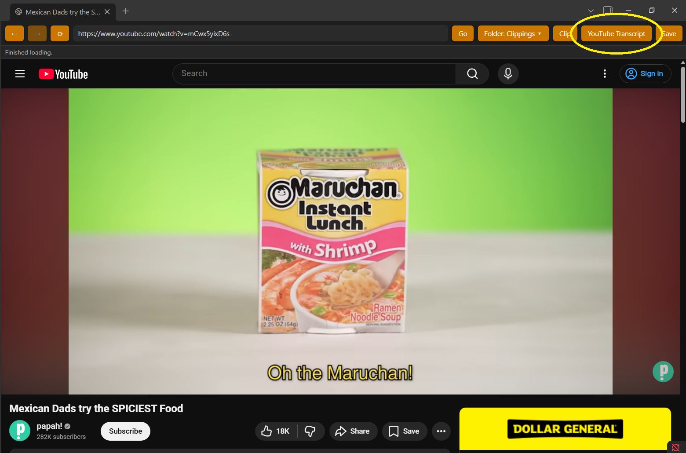
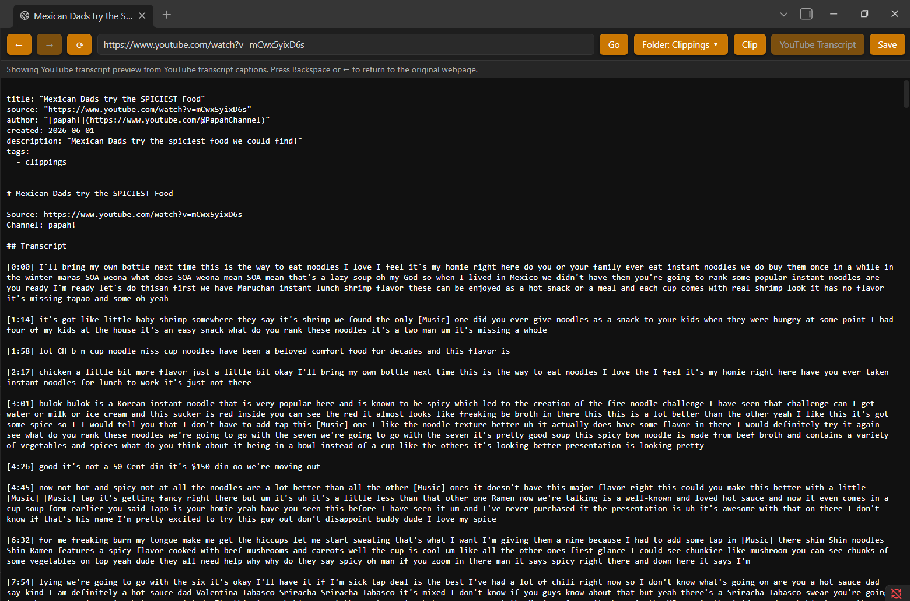

# Internal Defuddle Browser

Browse, Defuddle-clean, transcribe, and save web knowledge directly inside Obsidian.

Internal Defuddle Browser is an early-preview desktop Obsidian plugin for people who use Obsidian as a second brain, research hub, writing workspace, or AI-agent-ready knowledge vault.

It adds an internal browser to Obsidian, lets you clean article pages with Defuddle, preview the result as Markdown, fetch YouTube transcripts when available, and save approved notes directly into your vault.

## Screenshots

### Browse inside Obsidian



### Preview Defuddle-cleaned Markdown



### Choose where clips should be saved



### Open YouTube in the internal browser



### Preview YouTube transcripts as Markdown



## Status

Early preview. Desktop only. Not yet submitted to the official Obsidian community plugin directory.

Please expect rough edges. Feedback, bug reports, install issues, and workflow ideas are welcome.

## Install early preview

Download the latest release:

https://github.com/Predatory-Sandwich/internal-defuddle-browser/releases/latest

1. Download `internal-defuddle-browser-0.0.1.zip` from the latest release.
2. Unzip it.
3. Move the unzipped `internal-defuddle-browser` folder into your vault's plugins folder:

   ```text
   .obsidian/plugins/internal-defuddle-browser/
   ```

4. Restart Obsidian or reload plugins.
5. Go to `Settings -> Community plugins`.
6. Enable `Internal Defuddle Browser`.

The installed plugin folder should contain:

```text
internal-defuddle-browser/
  main.js
  manifest.json
  styles.css
```

## Why this exists

A lot of web clipping workflows either leave the browser, save noisy pages, or require several copy/paste steps. This plugin is an experiment in making Obsidian itself a focused research browser: open the page, clean it, review it, and save it where it belongs.

## What it does

- Opens a browser view inside Obsidian.
- Loads a configurable default home page.
- Keeps normal HTTP/HTTPS links inside the internal browser instead of opening them externally.
- Captures the rendered page DOM from the internal browser.
- Runs Defuddle extraction for article pages and shows the result as a full-page dark monospace Markdown preview.
- Fetches available YouTube captions/transcripts and previews them as timestamped Markdown.
- Lets Backspace return from the Markdown preview to the original webpage.
- Saves the approved Markdown preview into the vault.
- Uses an Obsidian-style collapsed folder tree for choosing the clipping destination.
- Supports customizable toolbar button colors.

## Browser toolbar

The browser view includes:

- Back
- Forward
- Reload
- URL field
- Go
- Folder selector
- Clip
- Transcript
- Save

Clicking the URL field selects the whole URL, so you can click once, press Backspace, and type a new site. Use `Clip` for article pages and `Transcript` for YouTube videos.

## Settings

Open Obsidian settings and find `Internal Defuddle Browser settings`.

Available settings:

- Default home page
  - The page loaded when the Internal Defuddle Browser opens.
  - Default: `https://example.com`

- Default clipping folder
  - The folder selected by default for saved Markdown clips.
  - Default: `Clippings`
  - Nested paths are supported, for example: `Articles/Web Clips`

- Button background color
  - Applies to Back, Forward, Reload, Go, Folder, Clip, Transcript, and Save.

- Button text color
  - Applies to the same browser toolbar buttons.

- Button border color
  - Applies to the same browser toolbar buttons.

- Reset button colors
  - Restores the default toolbar button colors.

## Article clipping workflow

1. Open the Internal Defuddle Browser from the ribbon icon, command palette, or empty new-tab launcher.
2. Browse to an article.
3. Click `Clip`.
4. Review the full-page Markdown preview.
5. Press Backspace if you want to return to the webpage.
6. Click the folder selector if you want a different destination.
7. Click `Save` to create the note.

## YouTube transcript workflow

1. Browse to a YouTube video.
2. Click `Transcript`.
3. Review the timestamped Markdown transcript preview.
4. Press Backspace if you want to return to the video page.
5. Click the folder selector if you want a different destination.
6. Click `Save` to create the transcript note.

Transcript availability depends on YouTube captions. Some private, unavailable, or captions-disabled videos may not return a transcript.

## Saved note format

Saved article notes include clean YAML/frontmatter like:

```yaml
---
title: "Article title"
source: "https://example.com/article"
author: "Author Name"
published: 2024-03-02
created: 2026-06-01
description: "Article description"
tags:
  - clippings
---
```

`site` is intentionally not saved because `source` already identifies the origin.

YouTube transcript notes include extra frontmatter like:

```yaml
---
title: "Video title"
source: "https://www.youtube.com/watch?v=..."
type: "youtube_transcript"
video_id: "..."
author: "Channel name"
created: 2026-06-01
description: "Video description"
duration_seconds: 1234
tags:
  - clippings
  - youtube
  - transcript
---
```

## Folder picker

The folder picker is designed to feel like Obsidian's file explorer:

- top-level folders are shown first
- folders are collapsed by default
- folders can be expanded/collapsed with the arrow
- clicking a folder name chooses that destination
- root slash entries are hidden
- visible folder order follows the left file explorer when possible

## Development

Install dependencies:

```bash
npm install
```

Build:

```bash
npm run build
```

Runtime files for an installed vault plugin are:

- `manifest.json`
- `main.js`
- `styles.css`

## Notes

This plugin is desktop-only because it relies on Electron's internal `webview` element.
